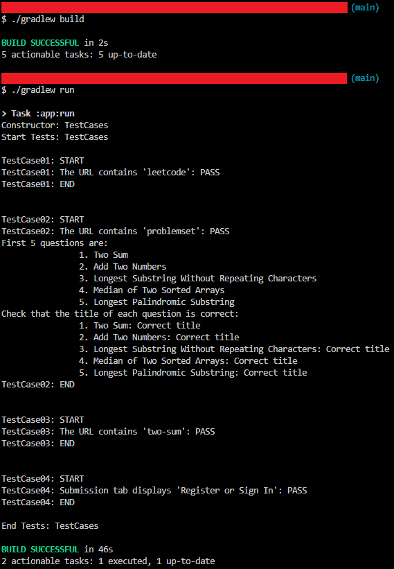

# LeetCode automation

`Selenium` `Dynamic Xpath`

---

During the course of this project automated Leetcode website to check and validate the latest 5 questions from the LeetCode problems page and ensure submitting solutions are blocked without Sign In.

---

# Overview
During the course of this project automated Leetcode website to check and validate the latest 5 questions from the LeetCode problems page and ensure submitting solutions are blocked without Sign In.

# Automating Leetcode
## Scope of work
* Automated the following test cases:
    * Verify the Leetcode Homepage URL.
    * Verify Problem Set URL and Display First 5 Questions.
    * Verify the Two Sum problem.
    * Ensure the submissions tab displays "Register or Sign In".

## Skills used
`Selenium` `Dynamic Xpath`

---

# Screenshots

> Gradle build, gradle run
